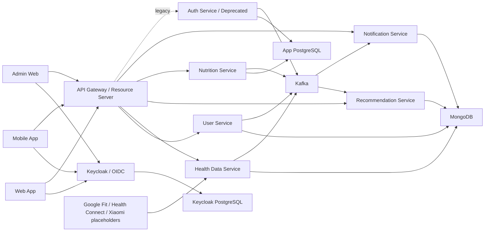
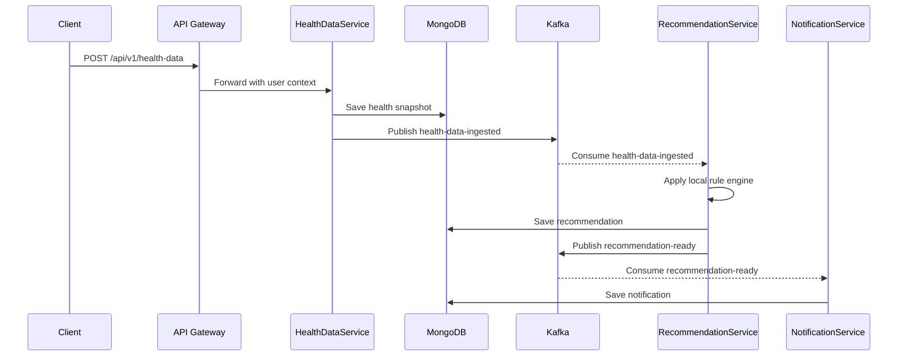
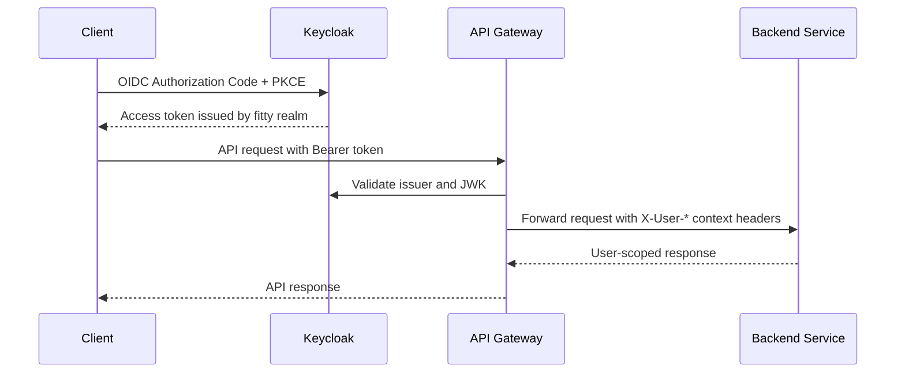

# Fitty Architecture

## Component Diagram

## Manual Health Data Ingestion

## Identity and Login

Keycloak is the central identity provider for local Kubernetes. Email/password login, registration, Google and Facebook federation belong to Keycloak, not to Fitty microservices. The existing `auth-service` is kept as a legacy service during migration and should not be used for new login flows.

The API Gateway validates JWTs from the `fitty` realm and forwards only derived user context to downstream services:

- `X-User-Id`
- `X-User-Email`
- `X-User-Roles`

Services must still enforce domain authorization. Frontend hiding is not sufficient.

## Admin and User Boundaries

Fitty has two primary interfaces:

- User app: personal dashboard, goals, body composition, health measurements, meals, nutrition plans, workout plans and recommendations.
- Admin app: user/profile administration, subscription plan management, and visibility into user workout/nutrition plans.

Admins must not access sensitive user health measurements such as heart rate, blood pressure, steps, clinical measurements or detailed body metrics. The first baseline enforces this in `health-data-service` by rejecting admin-only access and keeps admin user endpoints limited to profile/subscription fields plus plan placeholders.

## Domain Split

The product should stop treating all measurements as one generic "Health" bucket. The baseline split is:

- Body Composition: weight, height, BMI, body fat percentage and body circumferences.
- Health Measurements: blood pressure, resting heart rate, sleep, hydration and notes.
- Activity Metrics: steps, workouts, active minutes and future wearable imports.

Manual input remains first-class. Wearable and provider integrations stay as placeholders until credentials, provider contracts and consent flows are implemented.

## Recommendation Baseline

The recommendation service should prefer deterministic rule-based recommendations for the local runtime. Recommendations must be based on stored user goals, meals, hydration, sleep, activity and measurements when available. LLM or vision providers can be integrated later behind explicit adapters, but local Kubernetes must remain usable without external AI services.

## Event Reliability Notes

The local starter uses JSON events and Kafka auto topic creation. Production should add explicit schemas, retry topics, DLQ topics, idempotency keys, consumer offsets monitored through alerts, and versioned event contracts.
