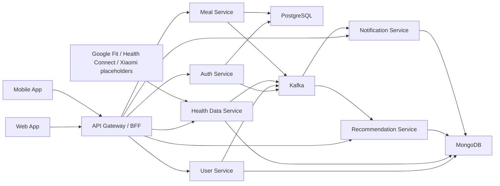
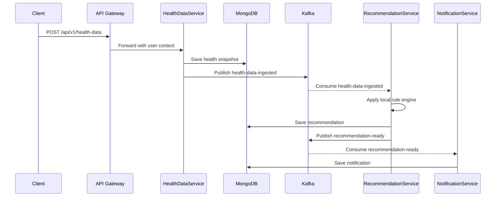
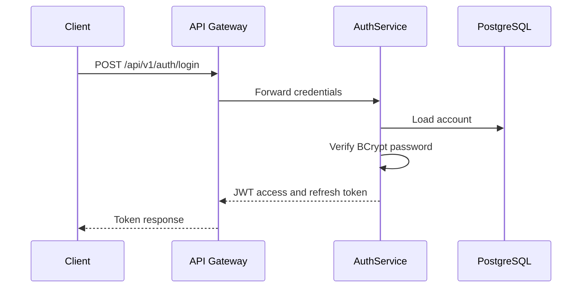

# Fitty Architecture

## Component Diagram

## Manual Health Data Ingestion

## Login

## Event Reliability Notes

The local starter uses JSON events and Kafka auto topic creation. Production should add explicit schemas, retry topics, DLQ topics, idempotency keys, consumer offsets monitored through alerts, and versioned event contracts.
